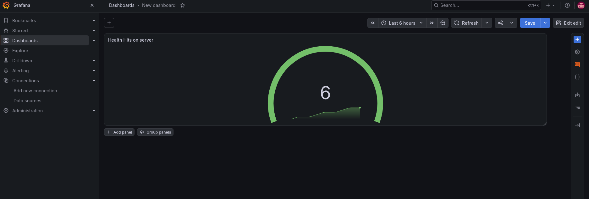

# stand-monitor

## Второй учебный стенд для позиции junior DevSecOps

Небольшой стенд из 3-х сервисов. Сервер с двумя ручками, helth и metrics. А также прометей с графаной. 

При подъёме контейнера докер регулярно дёргает ручку health, а в metrics счётчик увеличивается каждый раз когда дёргают health и отдаёт это всё в прометей. Графана же берёт метрику из прометея и выводит в дашборд.

1. Команда запуска `docker-compose up -d`.  
Команнда для проверки здоровья сервиса `curl -f http://localhost:8080/health`  
Команда для вывода метрик `curl http://localhost:8080/metrics`

2. Метрики из ручки /metrics передаются в прометей.

3. Графана забирает метрики из прометея и рисует дашборд.  

4. .....